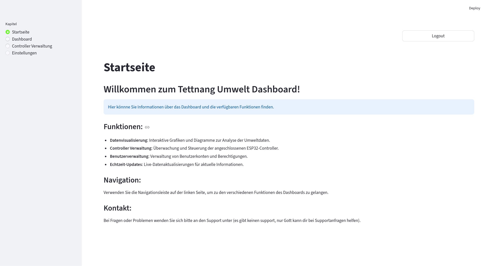
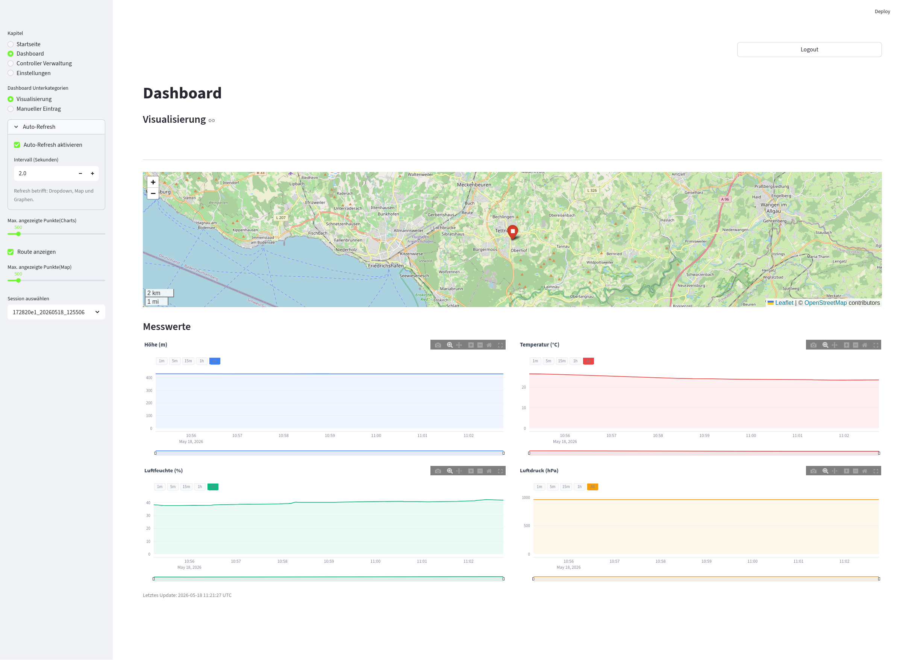
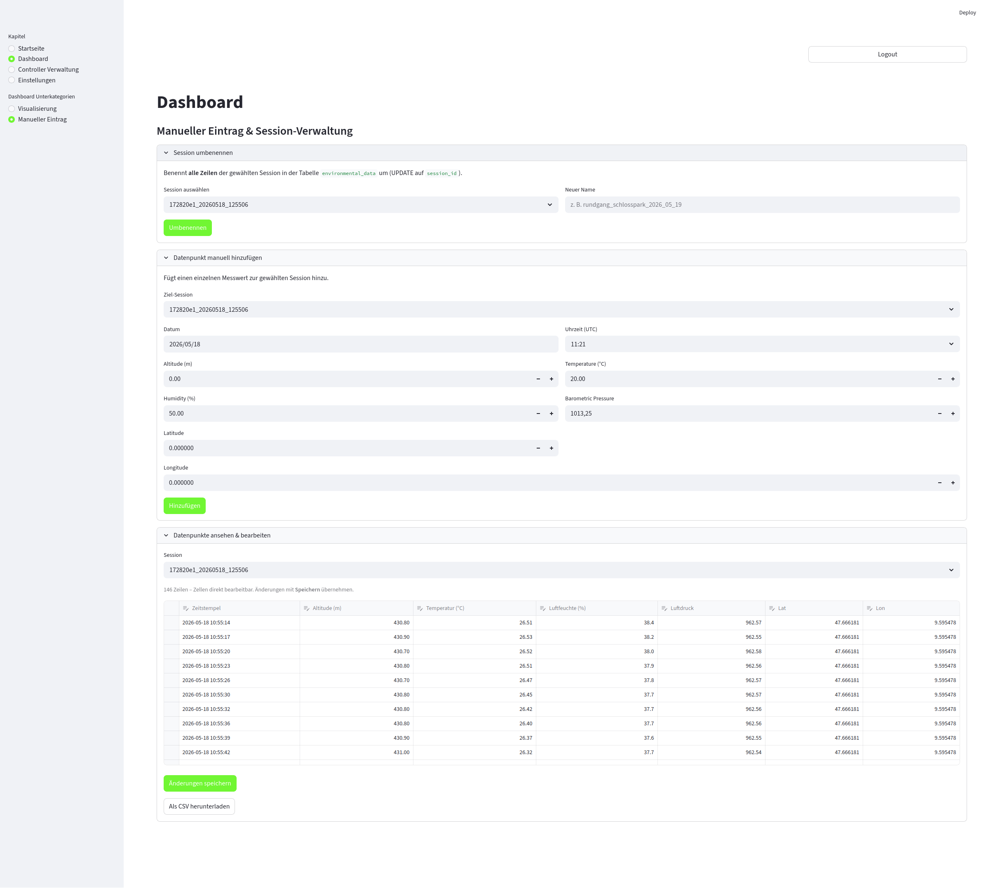
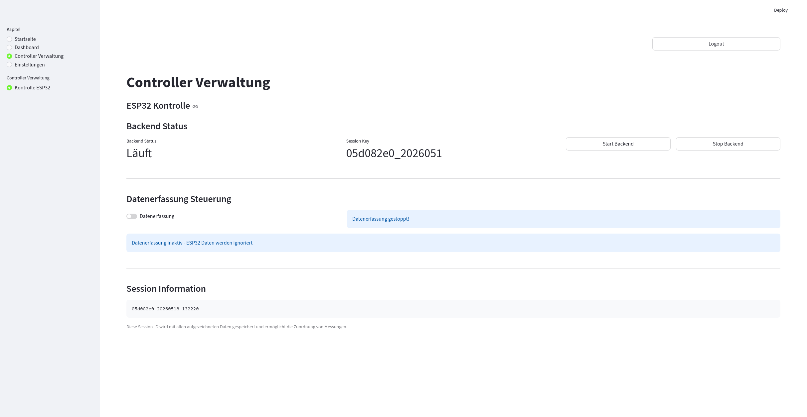
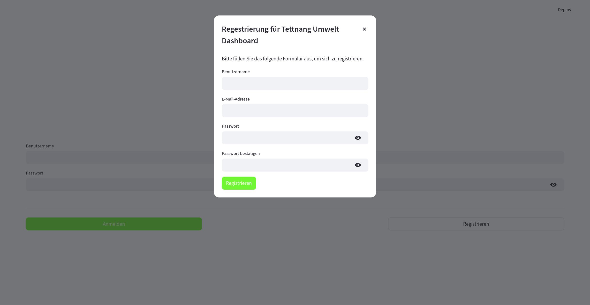
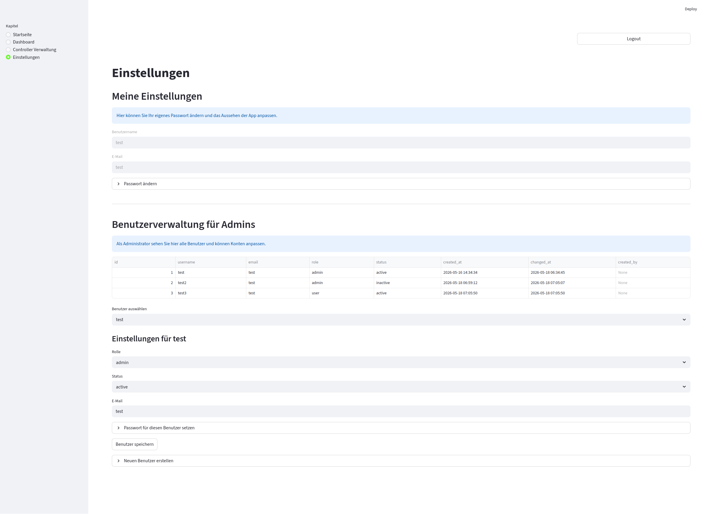
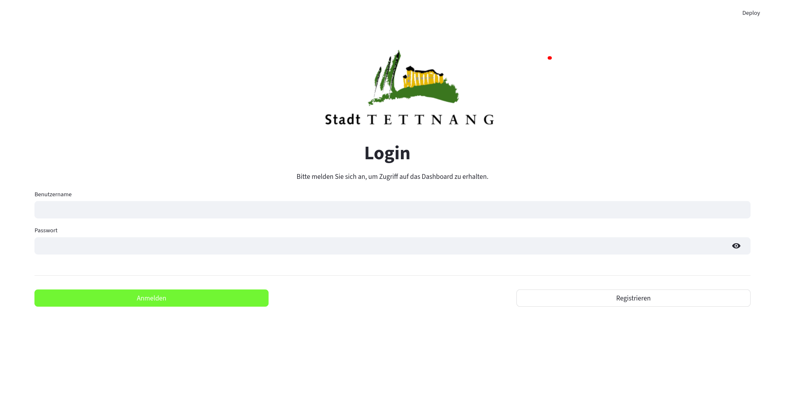

# Klima-/Umwelt-Dashboard (Streamlit)

Dieses Projekt ist ein **Streamlit-basiertes Web-Dashboard** für den Betrieb/Übersicht von Daten rund um **Umwelt/Climate**. Nach dem Login erscheint eine Navigation (Sidebar) mit mehreren Kapiteln.

## Inhaltsverzeichnis
- [Technologien](#technologien)
- [Projektstruktur](#projektstruktur)
- [Seiten / Navigation](#seiten--navigation)
- [Login / Authentifizierung](#login--authentifizierung)
- [Konfiguration](#konfiguration)
- [Starten der App (lokal)](#starten-der-app-lokal)
- [Docker (falls verwendet)](#docker-falls-verwendet)
- [Testing & Debug-Hinweise](#testing--debug-hinweise)
- [TODO](#todo)

## Technologien
- **Python**
- **Streamlit**
- **Pandas / NumPy** (für Datenverarbeitung)
- **MariaDB/MySQL** (über Umgebungsvariablen, siehe Konfiguration)
- Optional/Plugin: `streamlit_plugins.components.navbar` (im Code als Möglichkeit vorhanden)

## Projektstruktur
Wichtige Dateien/Ordner:

- `app.py`
  - Startpunkt der Streamlit-App
  - Session-Logik: Login oder Dashboard-UI
- `auth/`
  - `auth.py`: Login/Registrierung (Benutzerverwaltung)
- `gui/`
  - `navbar.py`: Navigation/Sidebar-Logik (Kapitel-Auswahl)
  - **Pro Seite eine eigene Datei**:
    - `startseite.py`
    - `dashboard.py`
    - `controller_verwaltung.py`
    - `einstellungen.py`
- `graphics/`
  - Bilder/Assets (z.B. Logos, Hintergründe)
- `config.toml`
  - Streamlit-Konfiguration (falls genutzt)

## Seiten / Navigation
Die Navigation passiert über `st.sidebar.radio("Kapitel", ...)` in:

- `gui/navbar.py`
  - **Startseite**
  - **Dashboard**
    - Unterkategorien (ebenfalls als Sidebar-radio):
      - Visualisierung
      - Manueller Eintrag
  - **Controller Verwaltung**
    - Unterkategorien (ebenfalls als Sidebar-radio):
      - Kontrolle ESP32
      - Verwaltung ESP32
  - **Einstellungen**

### Wichtig (Streamlit DuplicateElementId)
In `gui/navbar.py` werden für alle `st.sidebar.radio(...)`-Elemente **separate `key=`** gesetzt, damit Streamlit keine doppelten Widget-IDs erzeugt.

## Login / Authentifizierung
Die Auth-Logik befindet sich in:
- `auth/auth.py`

In `app.py` wird geprüft:
- Wenn `st.session_state.logged_in` **false** ist → `login()` (und ggf. `register_user()`)
- Wenn **true** ist → UI mit Navigation (`render_navbar_top_dashboard()` und `render_navbar_side_dashboard()` wird korrekt nur einmal gerendert)

## Konfiguration
MariaDB-Verbindungsdaten werden aktuell in `app.py` über `os.environ.setdefault(...)` gesetzt. Diese Variablen sind:

- `MARIADB_HOST`
- `MARIADB_PORT`
- `MARIADB_USER`
- `MARIADB_PASSWORD`
- `MARIADB_DATABASE`

Empfehlung: In Docker/Production diese Werte per **Environment Variables** übergeben und nicht hart im Code lassen.

## Nutzung der App
Die App ist als Streamlit-Dashboard ausgelegt und zeigt Umweltdaten, Grafiken und Karten in einer klaren Benutzeroberfläche.

- **Grafik-Elemente:** Die wichtigsten Visualisierungen befinden sich im `gui/dashboard.py`. Achte darauf, dass Diagramme und Karten beschriftet sind, damit Nutzer sofort erkennen, was angezeigt wird.
- **Navigation:** Nutze die Sidebar für die Auswahl von Kapiteln wie Startseite, Dashboard, Controller-Verwaltung und Einstellungen.
- **Karten/Daten:** Wenn GPS- oder Umweltdaten angezeigt werden, sollten sie als Punkte oder Route auf der Karte dargestellt werden. Eine Legende oder Hilfetexte machen die Darstellung verständlicher.
- **Hervorhebungen:** Wichtige Status-Informationen bitte farblich oder mit Text hervorheben (z. B. „Aktiv“, „Fehler“, „Letzte Aktualisierung“).

## Starten der App (lokal)
1. Virtuelle Umgebung aktivieren (falls vorhanden):

```bash
source venv/bin/activate
```

2. Abhängigkeiten installieren:

```bash
pip install -r requirements.txt
```

3. Streamlit starten:

```bash
streamlit run app.py
```

4. Die App im Browser öffnen:

- Standardmäßig: `http://localhost:8501`
- Wenn der Port oder die Adresse angepasst wurde, die entsprechende URL verwenden.

## Portainer Deployment
Diese App kann direkt über Portainer als Container bereitgestellt werden. Vorausgesetzt ist ein lauffähiges `Dockerfile` im Projektverzeichnis.

### 1. Docker-Image bauen
Im Projektordner ausführen:

```bash
docker build -t klima-dashboard .
```

### 2. Container in Portainer anlegen
1. Portainer öffnen.
2. In der linken Navigation auf **Containers** klicken.
3. Auf **Add container** klicken.
4. Einen eindeutigen Namen vergeben, z. B. `klima-dashboard`.
5. Als **Image** `klima-dashboard` eintragen.
6. Unter **Publish a new network port** den Host-Port und den Container-Port anlegen:
   - Host-Port: `8501`
   - Container-Port: `8501`
7. Falls erforderlich, Umgebungsvariablen setzen:
   - `MARIADB_HOST`
   - `MARIADB_PORT`
   - `MARIADB_USER`
   - `MARIADB_PASSWORD`
   - `MARIADB_DATABASE`
8. Auf **Deploy the container** klicken.

### 3. Container prüfen
- Nach dem Start die Logs ansehen, um sicherzustellen, dass Streamlit erfolgreich gestartet ist.
- Zugriff über den Browser prüfen: `http://<IP-des-Servers>:8501`
- Bei Problemen:
  - Logs des Containers in Portainer prüfen.
  - Netzwerk-/Port-Konfiguration verifizieren.
  - Gegebenenfalls den Container neu starten.

### 4. Empfehlung für Portainer
- Für persistente Konfigurationen oder Datenvolumes kann ein Volume-Mount in Portainer eingerichtet werden.
- Bei Nutzung von Datenbanken sollte ggf. ein separates Docker-Netzwerk verwendet werden, damit die Container sicher miteinander kommunizieren.

## Docker (falls verwendet)
Wenn ein `Dockerfile` vorhanden ist (hier vorhanden), kann die App typischerweise gebaut und gestartet werden. Beispiel (je nach Dockerfile/Setup):
```bash
docker build -t klima-dashboard .
docker run -p 8501:8501 \
  -e MARIADB_HOST=... \
  -e MARIADB_PORT=... \
  -e MARIADB_USER=... \
  -e MARIADB_PASSWORD=... \
  -e MARIADB_DATABASE=... \
  klima-dashboard
```

## Testing & Debug-Hinweise
### Sidebar-Visibility / Navigation
- Seiten werden über `gui/*` Dateien gerendert und über `gui/navbar.py` gesteuert.
- Wenn Streamlit Fehler zu Widgets meldet (z.B. DuplicateElementId), liegt das fast immer an:
  - mehrfach gerenderten Widgets in derselben Run-Iteration
  - fehlenden/identischen `key` Parametern

### (Optional) Plugin-Navbar
Falls die Plugin-Navbar (z.B. `st_navbar`) Probleme macht oder das Layout überlagert, wurde im Code ein deterministischer Fallback (native Sidebar Navigation) genutzt.

## TODO
Siehe auch:
- `TODO.md`

## Screenshots

Below are screenshots from the `docu_res/` folder illustrating the main pages and features.

- **Startseite**

  

- **Dashboard — Visualisierung**

  

- **Dashboard — Manueller Eintrag**

  

- **Controller Verwaltung — Kontrolle**

  

- **Registrierung / Benutzer**

  

- **Benutzereinstellungen**

  

- **Overview / Landing**

  

## Seiten (Kurzbeschreibung)

- **Startseite** ([gui/startseite.py](gui/startseite.py)):
  - Begrüßungs- und Übersichtsseite; erklärt Funktionen des Dashboards und führt zur Navigation.
  - Eignet sich, um neuen Anwendern schnell die verfügbaren Bereiche (Visualisierung, Controller, Einstellungen) zu zeigen.

- **Dashboard** ([gui/dashboard.py](gui/dashboard.py)):
  - Hauptseite für Datenvisualisierung und Analyse.
  - Unterkategorien:
    - **Visualisierung**: Interaktive Plotly-Charts für Höhe, Temperatur, Luftfeuchte und Luftdruck; Folium-Karte mit GPS-Punkten/Route.
    - **Manueller Eintrag**: Session-Verwaltung (umbenennen), manuelles Hinzufügen einzelner Messpunkte, tabellarischer Editor und CSV-Export.
  - Datenquelle: Tabelle `environmental_data` über Datenbankverbindung aus [auth/auth.py](auth/auth.py).

- **Controller Verwaltung** ([gui/controller_verwaltung.py](gui/controller_verwaltung.py)):
  - Schnittstelle zur Steuerung des Backend-Managers (z. B. Start/Stop, Session-Key anzeigen).
  - Steuerung der Datenerfassung für angeschlossene ESP32-Controller (Steuersignal toggeln).

- **Einstellungen** ([gui/einstellungen.py](gui/einstellungen.py)):
  - Persönliche Einstellungen: Passwort ändern, Anzeigeoptionen.
  - Admin-Bereich: Benutzerübersicht, Rollen/Status ändern, Benutzer erstellen.

- **Login / Authentifizierung** ([auth/auth.py](auth/auth.py) & [app.py](app.py)):
  - Login-Flow und Session-Handling: bei nicht eingeloggten Nutzern wird dasLogin-Formular angezeigt; nach Login wird Navigation und Dashboard gerendert.
  - DB-Verbindung und Benutzerverwaltung leben in `auth/auth.py`.

## Wie die Seiten zusammenarbeiten

- **Routing & Navigation**: Die Navigation wird in [gui/navbar.py](gui/navbar.py) gesteuert. Nach dem Login wird `render_navbar_top_dashboard()` und `render_navbar_side_dashboard()` verwendet; die native Sidebar ist die Fallback-Routing-Logik.

- **Datenfluss**: Das `dashboard` liest Messdaten aus der Datenbank (`environmental_data`) über `get_db_connection()` (siehe [auth/auth.py](auth/auth.py)). Charts werden aus Pandas-DataFrames mit Plotly erzeugt; Karten mit Folium gerendert und mit `streamlit_folium` eingebettet.

- **Controller / Backend**: Der Backend-Manager (in `backend_manager.py` / `backend.py`) stellt Start/Stop-Funktionen und ein Steuersignal bereit; die Controller-Verwaltungsseite sendet diese Signale und zeigt Statusinformationen an.

- **Benutzerverwaltung**: Admins können Benutzer anlegen/ändern; Einstellungen synchronisieren über Funktionen in `auth/auth.py`.

## Hinweise & Empfehlungen

- Bilder: Die Screenshots liegen in `docu_res/` — beim Export/Container-Build sicherstellen, dass dieses Verzeichnis im Image enthalten ist, falls Sie die README-Bilder in der Container-Dokumentation zeigen wollen.
- Konfiguration: Produktionswerte (Datenbank-Zugang) per Environment-Variablen setzen, nicht in Code (siehe `config.toml` und Docker-Abschnitt).

---

If you want, I can further refine the page descriptions (e.g. add list of available controls per page), commit the changes, or generate a short developer-oriented quickstart. Which would you like next?
